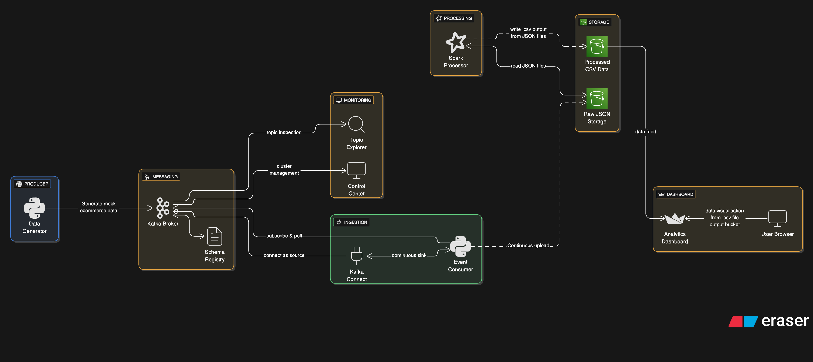

# Kafka Ecommerce Analytics Platform

A comprehensive real-time ecommerce analytics platform built with Confluent Kafka, running locally with Docker Compose and visualising data using streamlit.

## Architecture Diagram 

Created using eraser.io: https://www.eraser.io/git-diagrammer



## Architecture Components

- **Confluent Kafka**: Message streaming platform
- **Producer**: Generates mock ecommerce events
- **Consumer**: Processes individual events
- **Spark Processor**: Real-time stream processing and analytics
- **Dashboard**: Streamlit-based real-time visualization
- **Control Center**: Confluent's management interface

## Project Structure
```bash
kafka-ecommerce-platform/
├── docker-compose.yml              # Docker Compose configuration for all services
├── Makefile                        # MakeFile for project orchestration
├── requirements.txt                # Python dependencies
├── .env                            # Environment variables for development
├── .gitignore                      
├── docs/
│   ├── README.md                   # Project README
│   └── architecture.png            # Architecture diagram
├── src/
│   ├── config.py                   # Shared configuration
│   ├── kafka_producer.py           # Kafka producer script
│   ├── kafka_consumer.py           # Kafka consumer script
│   ├── spark_processor.py          # Spark batch processor script
│   ├── dashboard.py                # Streamlit dashboard app
│   └── ...                         # Other source files
├── docker/
│   ├── Dockerfile.producer         # Dockerfile for producer
│   └── Dockerfile.consumer         # Dockerfile for consumer
├── kafka-connect-jars/             # Custom Kafka Connect plugins
└── venv                            # You will need to create this venv
```

## Features

- Real-time ecommerce event generation (orders, page views, cart actions)
- Stream processing with Apache Spark
- Interactive dashboard with live metrics
- Schema management with Schema Registry
- Docker containerization
- Configuration management
- Confluent Control Center monitoring

## Quick Start

### Prerequisites

- Docker Desktop for Mac
- Docker Compose
- Make

### Setup

1. **Clone the repository**

   ```bash
   git clone <repository-url>
   cd kafka-ecommerce-platform
   ```

2. **Start the platform**

   ```bash
   make up
   ```

3. **Access services**
   - Control Center: http://localhost:9021
   - Dashboard: http://localhost:8501

### .env file setup 

```bash
# AWS credentials for S3 access (required for consumer, spark, etc.)
AWS_ACCESS_KEY_ID=your-aws-access-key-id
AWS_SECRET_ACCESS_KEY=your-aws-secret-access-key
AWS_REGION=your-aws-region

# Kafka settings
KAFKA_BOOTSTRAP_SERVERS=broker:29092
KAFKA_TOPIC= <topic_name>

# S3 bucket name (if referenced in your code)
S3_BUCKET_NAME= <your_bucket_name>

# (Optional)
LOG_LEVEL=INFO
```

### Component Status
   1. Check all services
      ```bash
      docker-compose ps -a
      ```

   2. View logs
      ```bash
      make logs
      ```

## Components

### Data Generator

- Generates realistic ecommerce events
- Configurable event rates and patterns
- Users are able to customise this file as they wish for generated mock data

### Kafka Producer

- Streams events to Kafka topics
- Schema Registry integration
- Configurable batch sizes and intervals

### Kafka Consumer

- Real-time event processing
- Data is ingested via kafka-connect into an s3 bucket
- Error handling and retry logic

### Spark Processor

- Stream processing with structured streaming
- Real-time analytics calculations
- Integration with Kafka and Schema Registry

### Dashboard

- Real-time metrics visualization
- Interactive charts and graphs
- Auto-refresh capability

## Configuration

### Environment Variables

```bash
# For local development (outside Docker)
KAFKA_BOOTSTRAP_SERVERS=localhost:9092
KAFKA_TOPIC=ecommerce-events

# For Docker containers (set in docker-compose.yml)
KAFKA_BOOTSTRAP_SERVERS=broker:29092
KAFKA_TOPIC=ecommerce-events
```

---

## Python Virtual Environment Setup

It is recommended to use a Python virtual environment for local development:

```bash
# Create and activate a virtual environment
python3 -m venv venv
source venv/bin/activate

# Install dependencies
pip install -r requirements.txt
```

---

## Development

### Local Development

```bash
# Build docker images for kafka producer and kafka consumer (if you haven't already)
make build

# Start all services (Kafka broker, producer, consumer)
make up

# Run the spark processor
make processor

# Run the streamlit dashboard
make dashboard 

# View logs
make logs

# Stop services
make down

# Clean the setup 
make clean

```

### Running Producer and Consumer Locally

```bash
# In one terminal
python src/kafka_producer.py

# In another terminal
python src/kafka_consumer.py
```

---

## Monitoring

1. To list Kafka topics:

   ```bash
   docker exec broker kafka-topics --bootstrap-server localhost:9092 --list
   ```

2. To view messages in a topic:

   ```bash
   docker exec -it broker kafka-console-consumer --bootstrap-server localhost:9092 --topic ecommerce-events --from-beginning
   ```
---

## Troubleshooting

- If you see errors about replication factor or internal topics, you can ignore them for single-broker local development.
- Ensure your Python scripts use `localhost:9092` when running outside Docker, and `broker:29092` when running inside Docker containers.

### Further Troubleshooting Steps

1. Exec into the container

   ```bash
   docker exec -it ecommerce-consumer bash
   ```

2. Users are able to run the aws cli and check they are able to connect to aws and list their buckets from within the docker container

   ```bash
   apt-get update && apt-get install -y awscli
   ```

3. Test the connection to AWS

   a. Using AWS cli 
   ```bash
   aws sts get-caller-identity
   ```

   b. or with boto3

   ```bash
   python -c "import boto3, os; s3 = boto3.client('s3'); s3.put_object(Bucket=os.environ['BUCKET_NAME'], Key='test.txt', Body=b'hello world')"
   ```
---

## Contributing

1. Fork the repository
2. Create a feature branch
3. Make changes with tests
4. Submit a pull request